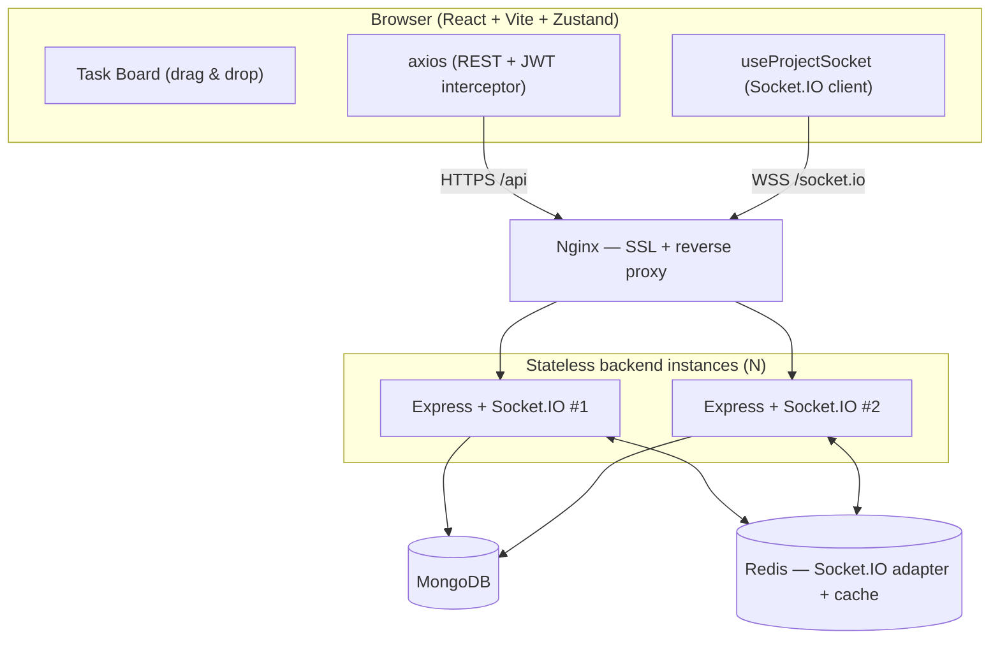

# Internal Project Management System (Real-Time)

A MERN project-management tool with **real-time task collaboration**. Multiple users share a
project; when one moves a task (Todo → In Progress → Done) on the Kanban board, every other
connected member sees it **instantly** over WebSockets, and anyone opening the project later
loads the latest **persisted** state.

> **Live URLs** (fill in after deploy)
> - Frontend: `https://real-time-pms-system.vercel.app`
> - Backend / API: `https://real-time-pms-system.onrender.com`

---

## Table of Contents
- [Architecture](#architecture)
- [Tech Stack & Key Decisions](#tech-stack--key-decisions)
- [Project Structure](#project-structure)
- [API Reference](#api-reference)
- [Socket Events](#socket-events)
- [Local Setup](#local-setup)
- [Deployment](#deployment)
- [Branching & CI/CD](#branching--cicd)
- [Further Docs](#further-docs)

---

## Architecture



The browser uses **REST** for request/response (auth, loading, mutations) and **WebSockets**
for live fan-out. Backends are **stateless**; shared state lives in MongoDB (durable) and
Redis (pub/sub + cache). Full detail in [`docs/SYSTEM_DESIGN.md`](docs/SYSTEM_DESIGN.md).

---

## Tech Stack & Key Decisions

| Layer | Choice | Why (trade-off) |
|---|---|---|
| Backend | **Express** | Minimal, ubiquitous; the mandated stack. |
| DB | **MongoDB + Mongoose** | Flexible documents fit Projects/Tasks; schemas + indexes add rigor. |
| Auth | **JWT (stateless)** | No server-side session store → scales horizontally. Trade-off: revocation needs a denylist (Redis-ready). |
| Real-time | **Socket.IO** | Rooms, auto-reconnect, transport fallback, first-class Redis adapter — vs. re-building all that on raw `ws`. |
| Scaling | **Redis adapter** | Two users on different instances still share a room. Without it, cross-instance fan-out breaks. |
| Validation | **Zod** | Schema-first, type-inferred, one validation middleware everywhere — vs. express-validator's imperative chains. |
| Frontend | **React + Vite** | Fast dev server + build; the mandated stack. |
| State | **Zustand** | Socket handlers update a normalized store **imperatively** via `getState()` (outside React) with no provider boilerplate. Lighter than Redux; avoids Context's re-render-every-consumer problem for high-frequency events. |
| Drag & drop | **@dnd-kit** | Accessible, modern, multi-column sortable — vs. hand-rolling the HTML5 drag API. |
| Errors | **`AppError` + central middleware** | One error shape; controllers stay free of try/catch. |

**Optimistic UI vs server-confirmed:** the *actor* applies a move locally immediately and
reconciles (rolls back) if the server rejects it; *observers* render only server-confirmed
events. **Persist-then-broadcast:** the DB write happens before the broadcast, so a
late-joiner's REST load can never diverge from the live stream.

---

## Project Structure

```
.
├─ backend/
│  ├─ src/
│  │  ├─ controllers/   # thin: parse req, call service, shape response
│  │  ├─ services/      # ALL business logic + the only layer touching Mongoose
│  │  ├─ routes/        # path + middleware wiring
│  │  ├─ models/        # Mongoose schemas + indexes
│  │  ├─ sockets/       # io.use() auth, room handlers, Redis adapter, emit helper
│  │  ├─ middleware/    # auth, Zod validation, central error handler
│  │  ├─ config/        # env loader, DB + Redis connections
│  │  ├─ validators/    # Zod schemas per endpoint
│  │  ├─ utils/         # AppError, catchAsync, jwt, response envelope
│  │  └─ app.js         # Express assembly
│  └─ server.js         # entry: connect infra -> attach sockets -> listen
├─ frontend/
│  └─ src/
│     ├─ api/           # axios instance + interceptors, per-resource modules
│     ├─ socket/        # single Socket.IO client
│     ├─ hooks/         # useProjectSocket (the socket abstraction)
│     ├─ store/         # Zustand: authStore, boardStore (normalized)
│     ├─ components/    # Column, TaskCard, reusable ui/*
│     └─ pages/         # Login, ProjectList, TaskBoard
├─ deploy/              # nginx.conf + DEPLOYMENT.md (Let's Encrypt steps)
├─ docs/                # FRD.md, SYSTEM_DESIGN.md
└─ .github/workflows/   # ci.yml (lint -> build -> deploy)
```

---

## API Reference

Base path `/api`. Protected routes need `Authorization: Bearer <jwt>`. Response envelope:
`{ success, data }` on success, `{ success: false, error: { code, message } }` on failure.

| Method | Endpoint | Purpose | Auth |
|---|---|---|---|
| POST | `/auth/register` | Create account, return JWT | Public |
| POST | `/auth/login` | Authenticate, return JWT | Public |
| GET | `/auth/me` | Current user | Required |
| POST | `/projects` | Create project (caller = owner) | Required |
| GET | `/projects` | List my projects | Required |
| GET | `/projects/:id` | Get project + members | Member |
| PATCH | `/projects/:id` | Update project metadata | Admin |
| DELETE | `/projects/:id` | Delete project (+ tasks) | Owner |
| POST | `/projects/:id/members` | Add member by email | Admin |
| DELETE | `/projects/:id/members/:userId` | Remove member | Admin |
| GET | `/projects/:id/tasks` | List tasks (paginated) | Member |
| POST | `/projects/:id/tasks` | Create task | Member |
| GET | `/tasks/:taskId` | Get task | Member |
| PATCH | `/tasks/:taskId` | Update task fields | Member |
| PATCH | `/tasks/:taskId/status` | **Move task (core action)** | Member |
| DELETE | `/tasks/:taskId` | Delete task | Member |

A ready-to-run `backend/requests.http` exercises the whole flow.

---

## Socket Events

Auth: JWT in the handshake (`socket.handshake.auth.token`), verified by `io.use()`. Room per
project: `project:<projectId>`. `join-project` re-checks membership before joining.

| Event | Direction | Payload | Received by |
|---|---|---|---|
| `join-project` | client → server | `{ projectId }` | (server) |
| `leave-project` | client → server | `{ projectId }` | (server) |
| `task:created` | server → clients | `{ task }` | room, except originator |
| `task:updated` | server → clients | `{ task }` | room, except originator |
| `task:moved` | server → clients | `{ taskId, status, position, projectId }` | room, except originator |
| `task:deleted` | server → clients | `{ taskId, projectId }` | room, except originator |
| `error` | server → client | `{ code, message }` | offending client |

Mutations go over REST (validated + persisted), and the server broadcasts the committed
result to the room — excluding the originator via the `x-socket-id` header (it already
applied the change optimistically).

---

## Local Setup

**Prerequisites:** Node 18+, a running MongoDB, a running Redis.

```bash
# 1. Backend
cd backend
cp .env.example .env          # set MONGO_URI, REDIS_URL, JWT_SECRET
npm install
npm run dev                   # http://localhost:4000  (API + WebSocket)

# 2. Frontend (new terminal)
cd frontend
cp .env.example .env          # defaults work with the Vite proxy
npm install
npm run dev                   # http://localhost:5173
```

**See real-time in action:** open two browsers (or a normal + incognito window), register two
users, have the owner add the second by email as a member, open the same project in both, and
drag a task in one — it moves in the other within a second.

Quick infra via Docker (optional):
```bash
docker run -d -p 27017:27017 --name mongo mongo:7
docker run -d -p 6379:6379  --name redis redis:7
```

---

## Deployment

Full instructions (VM + Nginx + Let's Encrypt, or Render + Netlify) in
[`deploy/DEPLOYMENT.md`](deploy/DEPLOYMENT.md). Nginx config: [`deploy/nginx.conf`](deploy/nginx.conf).

---

## Branching & CI/CD

**Branching:** trunk-based with short-lived branches.
- `main` is always deployable and protected (no direct pushes).
- Work happens on `feature/<thing>` (or `fix/<thing>`); open a **PR into `main`**.
- The PR triggers **lint + build** (`.github/workflows/ci.yml`); merge is blocked until green.
- Merging to `main` re-runs the gate and then **deploys**.

**Commits:** Conventional Commits (`feat:`, `fix:`, `chore:`, `docs:`) — small and meaningful.

**Pipeline** (`verify` → `deploy`):
1. **verify** (matrix: backend + frontend) — `npm ci`, `npm run lint`, frontend `npm run build`. Test stage is wired and commented, ready for tests.
2. **deploy** (only on push to `main`, after verify) — SSH to the VM, pull, install, rebuild the frontend, `pm2 reload` the API, reload Nginx.

---

## Further Docs
- [`docs/FRD.md`](docs/FRD.md) — functional requirements, roles, scope.
- [`docs/SYSTEM_DESIGN.md`](docs/SYSTEM_DESIGN.md) — architecture, schema, real-time protocol, scaling.
- [`AI_USAGE.md`](AI_USAGE.md) — where AI assistance was used.

### Guides
- [`LEARN_MERN.md`](LEARN_MERN.md) — beginner-friendly walkthrough of the whole codebase (learn MERN from this project).
- [`DEPLOY_VERCEL_RENDER.md`](DEPLOY_VERCEL_RENDER.md) — step-by-step deploy to Vercel (frontend) + Render (backend).
- [`LOOM_SCRIPT.md`](LOOM_SCRIPT.md) — script for the demo/explainer video.
- [`INTERVIEW_QA.md`](INTERVIEW_QA.md) — practice Q&A on the code and design.
