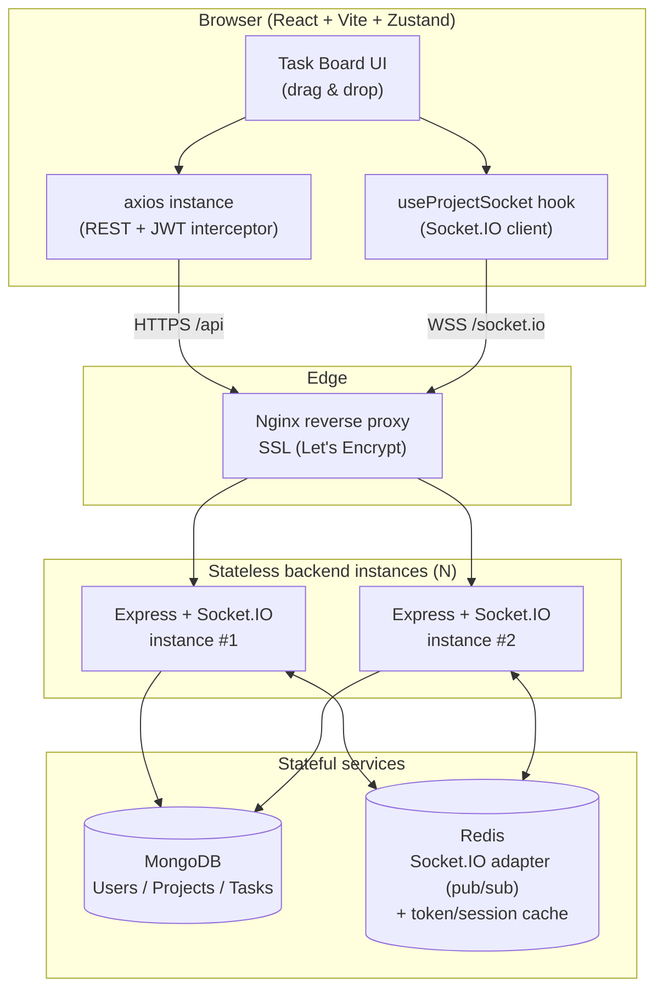
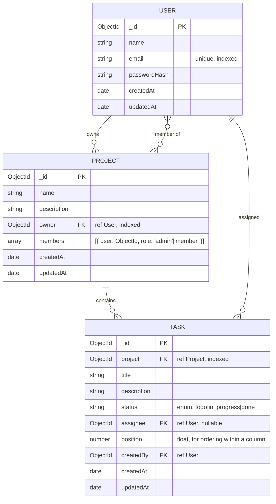
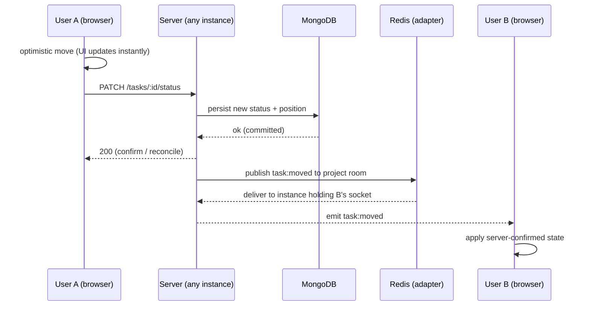

# System Design

**Project:** Internal Project Management System with Real-Time Task Collaboration
**Version:** 1.0
**Status:** Draft for approval (Phase 1)

This is the most heavily weighted document. It covers architecture, the API surface, the
data model, the real-time protocol, the rationale behind each major choice, and how the
system scales horizontally.

---

## 1. High-Level Architecture



**Reading the diagram:** the browser talks REST for request/response (auth, loading data,
mutations) and WebSocket for live fan-out. Nginx terminates SSL and routes `/api` →
Express HTTP and `/socket.io` → the WebSocket upgrade. Backend instances are **stateless**;
the only shared state lives in MongoDB (durable) and Redis (ephemeral pub/sub + cache).
That statelessness is what lets us run N instances behind the proxy.

---

## 2. Request Lifecycle (layering)

Every REST request flows through the mandated layering — controllers never touch Mongoose:

```
HTTP → route → [auth middleware] → [zod validation middleware] → controller → service → model → MongoDB
                                                                       │
                                                            (thin: parse req, call service,
                                                             shape response, next(err))
```

- **route** — declares path + method, wires middleware and the controller handler.
- **middleware** — auth (verify JWT), validation (Zod schema per endpoint), error handler (terminal).
- **controller** — thin glue: pulls validated data off `req`, calls a service, returns the response. No business rules.
- **service** — all business logic + the **only** layer that calls Mongoose models. Ownership/role checks live here.
- **model** — Mongoose schema + indexes.

A successful mutation that should be broadcast returns to the controller, which (or a thin
socket-emitter helper) publishes the corresponding socket event so all room members converge.

---

## 3. API Surface

Base path: `/api`. All protected routes require `Authorization: Bearer <jwt>`.
All responses share one envelope: `{ "success": boolean, "data"?: ..., "error"?: { code, message } }`.

### Auth
| Method | Endpoint | Purpose | Auth |
|---|---|---|---|
| POST | `/api/auth/register` | Create account, return JWT | Public |
| POST | `/api/auth/login` | Authenticate, return JWT | Public |
| GET | `/api/auth/me` | Current user profile | Required |

### Projects
| Method | Endpoint | Purpose | Auth |
|---|---|---|---|
| POST | `/api/projects` | Create a project (caller becomes owner) | Required |
| GET | `/api/projects` | List projects the user owns or is a member of | Required |
| GET | `/api/projects/:id` | Get one project + members | Member |
| PATCH | `/api/projects/:id` | Update project metadata | Owner/Admin |
| DELETE | `/api/projects/:id` | Delete project (+ its tasks) | Owner |
| POST | `/api/projects/:id/members` | Add a member | Owner/Admin |
| DELETE | `/api/projects/:id/members/:userId` | Remove a member | Owner/Admin |

### Tasks
| Method | Endpoint | Purpose | Auth |
|---|---|---|---|
| GET | `/api/projects/:id/tasks` | List tasks for a project (paginated) | Member |
| POST | `/api/projects/:id/tasks` | Create a task | Member |
| GET | `/api/tasks/:taskId` | Get one task | Member |
| PATCH | `/api/tasks/:taskId` | Update task fields (title, desc, assignee) | Member |
| PATCH | `/api/tasks/:taskId/status` | **Move task between columns** (core action) | Member |
| DELETE | `/api/tasks/:taskId` | Delete a task | Member |

> The status-move is its own endpoint (`/status`) rather than a generic PATCH so the
> hot-path action has a tight payload (`{ status, position }`), a focused validator, and a
> clear 1:1 mapping to the `task:moved` socket event. This is the route I'll explain
> line-by-line in the interview cheat sheet.

---

## 4. Database Schema



### Collections & indexes

**users**
- `email` — `unique` index (login lookups + dedupe).
- Password stored only as a bcrypt hash; never returned in API responses (`select: false`).

**projects**
- `owner` — index (list "my owned projects").
- `members.user` — index (list "projects I'm a member of"; also powers membership checks).

**tasks**
- Compound `{ project: 1, status: 1, position: 1 }` — index. This is the board-load query:
  fetch a project's tasks grouped by column and ordered within each column in one indexed scan.
- `assignee` — index (optional "tasks assigned to me" view).

### Ordering strategy
`position` is a **float**. Inserting between two cards sets `position = (prev + next) / 2`,
so a reorder writes **one** document instead of renumbering the whole column. (If floats ever
get too dense after many inserts, a background renormalize pass resets them to integers — noted
as a known, bounded edge case.)

---

## 5. Real-Time Communication Strategy

### Transport & rooms
- **Socket.IO** over WebSocket (with long-poll fallback).
- **One room per project**, named `project:<projectId>`. A socket only receives events for
  projects it has explicitly joined *and* is authorized to be in.
- Authentication: JWT passed in the handshake (`socket.handshake.auth.token`), verified in
  `io.use()` middleware. Unauthenticated handshakes are rejected before any event is wired.
- Authorization: `join-project` re-checks membership in the service layer before calling
  `socket.join()` — auth at handshake proves *who*, the join check proves *allowed in this room*.

### Event catalogue

| Event | Direction | Emitted by | Received by | Payload |
|---|---|---|---|---|
| `join-project` | client → server | a client opening a board | (server handler) | `{ projectId }` |
| `leave-project` | client → server | a client closing a board | (server handler) | `{ projectId }` |
| `task:created` | server → clients | server after POST task | all other members in room | `{ task }` |
| `task:updated` | server → clients | server after PATCH task | all other members in room | `{ task }` |
| `task:moved` | server → clients | server after PATCH status | all other members in room | `{ taskId, status, position, projectId }` |
| `task:deleted` | server → clients | server after DELETE task | all other members in room | `{ taskId, projectId }` |
| `error` | server → client | server on bad/unauthorized action | the offending client only | `{ code, message }` |

**Fan-out rule:** mutations go through REST (so they're validated, authorized, and
**persisted first**), and the server emits the resulting event to the room with
`socket.to(room).emit(...)` — i.e. to *everyone except the originator*, because the
originator already applied it optimistically. The DB write happens **before** the broadcast,
so the event always reflects committed state.



---

## 6. Why This Approach ("defend the decisions")

**Socket.IO over raw WebSocket** — we get rooms/namespaces (one line to broadcast to a
project), automatic reconnection with backoff, heartbeats, transport fallback, and a
first-class **Redis adapter**. Building rooms + reconnection + a pub/sub fan-out layer on
raw `ws` would be re-implementing exactly what Socket.IO already hardened.

**Redis adapter for horizontal scaling** — with multiple stateless backend instances behind
Nginx, User A and User B may be connected to **different** instances. A plain in-process
`io.emit` only reaches sockets on the same instance, so B would miss A's event. The Redis
adapter publishes each room emit over Redis pub/sub; every instance subscribed to that room
delivers to its local sockets. This is the single thing that makes real-time correct under a
load balancer. Redis also caches token/session lookups to avoid re-hitting Mongo on hot paths.

**Zustand over Redux/Context** — socket events arrive imperatively and frequently; Zustand
lets a socket handler call `useStore.getState().applyTaskMoved(...)` to update a normalized
store **outside React's render cycle**, with no provider boilerplate, no reducer/action
ceremony, and no Context re-render storms (Context re-renders every consumer on each change).
It's lighter than Redux and a better fit for high-frequency external events than Context.

**Optimistic UI vs server-confirmed** — the actor applies the change locally *immediately*
(snappy drag-and-drop) and reconciles when the server's `200`/event confirms; on failure it
rolls back. **Observers** are purely server-confirmed — they only render state the DB already
committed. So we get local snappiness without ever showing other users uncommitted state.

**Persist-then-broadcast ordering** — we write to Mongo *before* emitting. The broadcast can
never describe a state the database doesn't hold, so a late-joiner's REST load and the live
stream can't diverge.

---

## 7. Scalability Considerations

- **Stateless backend + Redis pub/sub** — no session affinity required; add instances
  freely, the Redis adapter keeps rooms coherent across all of them.
- **DB indexing** — the compound `{ project, status, position }` index serves the board-load
  query directly; `email`, `owner`, `members.user` indexes serve auth and project listing.
- **Pagination** — task and project lists are paginated (cursor/limit) so a large project
  doesn't ship thousands of docs in one response.
- **Thin hot path** — the status-move endpoint writes a single document (float `position`,
  no column-wide renumber) and emits a minimal payload, keeping the most frequent action cheap.
- **Stateless JWT auth** — no server-side session store to become a bottleneck; Redis caches
  only what genuinely helps (e.g. revocation/lookup), not request correctness.
- **Edge** — Nginx terminates SSL and can load-balance across instances; WebSocket upgrade is
  proxied with the right `Upgrade`/`Connection` headers.

---

## 8. Tech & Tooling Summary

| Concern | Choice | One-line justification |
|---|---|---|
| Validation | **Zod** | Schema-first, type-inferred, reusable across layers; one consistent validator middleware. |
| Errors | `AppError` + central middleware | One error shape, no try/catch sprawl in controllers. |
| Auth | JWT (stateless) | Scales horizontally without a session store. |
| State (FE) | Zustand | Imperative updates from socket handlers, minimal boilerplate. |
| API layer (FE) | axios instance + interceptors | One place for base URL, JWT injection, 401 handling. |
| Real-time (FE) | `useProjectSocket` hook | Socket lifecycle isolated from components. |
| Config | `.env` + `.env.example` | No hardcoded values; secrets never committed. |
| Lint/format | ESLint + Prettier | Consistent, reviewable code. |
